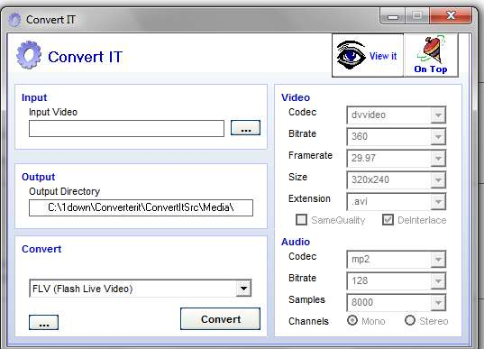



## ConvertIT Audio/Video Converter UPDATE

### Description

This is an update and correction for txtCodeId=70578 original program. It wasn't converting most of the supported video formats so I fixed it.

It uses ffmpeg.exe which is renamed to avformat.dll and placed in the app.path. I've supported the most recent build of ffmpeg.exe and I've placed it on my server: http://www.moosenose.com/avformat.zip. You may also download the original and compile it yourself: www.ffmpeg.org.

I've also added conversion to Animated GIFs of various resolutions. The program will stay top most and can open the saved directory and play the saved, converted video. I've removed the dependency to the Common Dialog Control which makes the program portable for all versions of Windows which already have the VB 6 Runtimes.

Other than that, the program is unchanged. Kindly give any positive feedback to the original author.
 
### More Info
 

             |
---                |---
**Submitted On**   |2010-11-30 17:21:22
**By**             |[Warren Goff](https://github.com/Planet-Source-Code/PSCIndex/blob/master/ByAuthor/warren-goff.md)
**Level**          |Intermediate
**User Rating**    |5.0 (35 globes from 7 users)
**Compatibility**  |VB 6\.0
**Category**       |[Graphics](https://github.com/Planet-Source-Code/PSCIndex/blob/master/ByCategory/graphics__1-46.md)
**World**          |[Visual Basic](https://github.com/Planet-Source-Code/PSCIndex/blob/master/ByWorld/visual-basic.md)
**Archive File**   |[ConvertIT\_21937711302010\.zip](https://github.com/Planet-Source-Code/warren-goff-convertit-audio-video-converter-update__1-73615/archive/master.zip)

